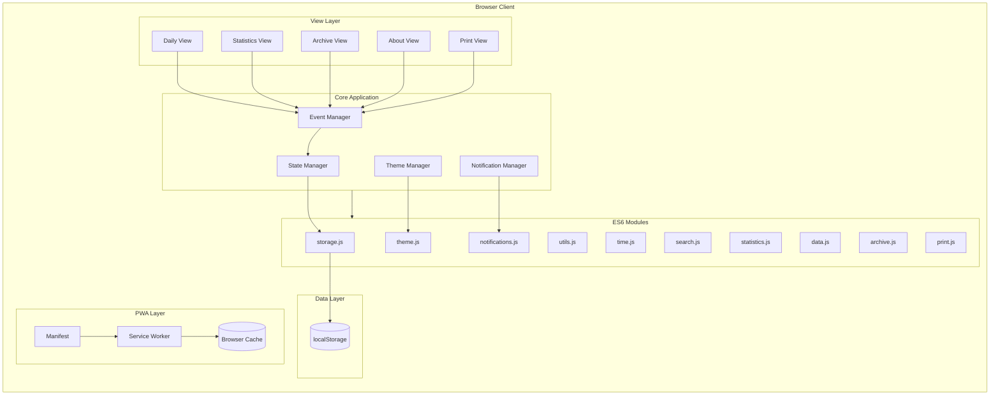
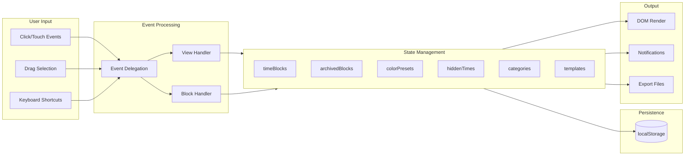

# Architecture Overview

## System Architecture Diagram



## Data Flow Diagram



## Key Architectural Decisions

### 1. Zero Dependencies Architecture

I made a deliberate choice to build this application with zero external dependencies. This decision was driven by several factors:

- **Simplicity**: No build step, no package manager, no node_modules. Just open `index.html` and it works.
- **Performance**: No framework overhead means faster load times and smaller bundle size (~150KB total).
- **Longevity**: No dependency updates to manage, no security vulnerabilities from third-party code, no breaking changes from upstream packages.
- **Learning**: Building everything from scratch forced me to deeply understand DOM manipulation, event handling, and state management.

### 2. Single-File vs Modular Code

The main `script.js` file is large (~3000 lines), but I kept it as a single file initially for simplicity. Later, I refactored common utilities into ES6 modules (`/modules/`) for better organization while maintaining backward compatibility:

```
modules/
├── index.js       # Re-exports all modules
├── storage.js     # localStorage operations
├── utils.js       # Common utilities
├── time.js        # Time parsing/conversion
├── search.js      # Search functionality
├── statistics.js  # Stats calculations
├── data.js        # Import/export
├── archive.js     # Archiving logic
├── print.js       # Print formatting
├── theme.js       # Dark mode
└── notifications.js # Browser notifications
```

### 3. localStorage for Persistence

I chose localStorage over IndexedDB because:

- **Simplicity**: Synchronous API, no callbacks or promises needed for basic operations
- **Sufficient Capacity**: 5-10MB is more than enough for time block data
- **No Setup**: Works immediately, no database initialization required
- **JSON-Native**: Perfect for storing JavaScript objects

Data structures:
- `timeBlocks`: Active schedule blocks with tasks, notes, colors
- `archivedBlocks`: Historical blocks organized by date
- `colorPresets`, `categories`, `blockTemplates`: User preferences
- `hiddenTimes`: Customized time slot visibility
- `theme`: Light/dark mode preference

### 4. Event Delegation Pattern

Instead of attaching event listeners to every block element, I implemented event delegation on the table body. This provides:

- **Performance**: Single listener handles all blocks
- **Dynamic Content**: Works automatically for newly rendered blocks
- **Memory Efficiency**: No listener cleanup needed when blocks are removed

### 5. Progressive Web App (PWA)

I implemented PWA features to make the app installable and offline-capable:

- **Service Worker**: Caches all static assets using stale-while-revalidate strategy
- **Web Manifest**: Enables "Add to Home Screen" on mobile devices
- **Offline First**: App works without internet connection

### 6. CSS Custom Properties for Theming

I used CSS custom properties (variables) for theming instead of JavaScript-based theme switching:

```css
:root {
  --bg-primary: #ffffff;
  --text-primary: #333333;
}
[data-theme="dark"] {
  --bg-primary: #1a1a1a;
  --text-primary: #e0e0e0;
}
```

Benefits:
- Instant theme switching with a single attribute change
- Respects system preference via `prefers-color-scheme`
- No JavaScript needed for style calculations

### 7. Responsive Design Philosophy

I built the UI mobile-first with responsive breakpoints:

- Touch-friendly interactions (drag-to-create works on mobile)
- Flexible layouts that adapt to screen size
- No separate mobile app needed - same codebase everywhere
